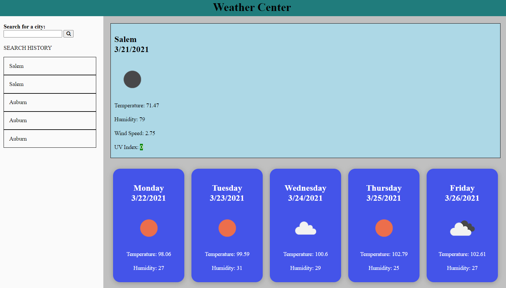

# WeatherCenter

This is a simple weather website that will tell you the current weather and 5 day forecast for almost any city you input

## Project Links

[GitHub Repository](https://github.com/JosephCordell/WeatherCenter)

[Webpage](https://josephcordell.github.io/WeatherCenter/)

## Screenshot of webpage 

## Features
- Provides current weather for searched city
- 5 day forecast
- Clickable search history

## What I learned 

- API calls
- AppendChild function
- How to further utilize local storage